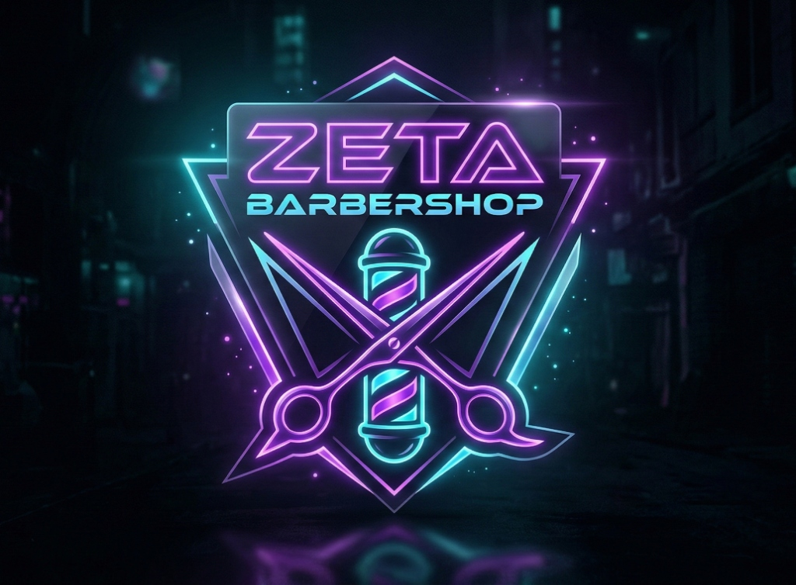

# Zeta Barbershop SaaS

<p align="center">
  
</p>

Zeta Barbershop is a modern, real-time Queue Management System built as a SaaS platform specifically designed for autonomous barbers. It completely replaces outdated booking systems by offering a dynamic, zero-friction smart queue.

The system calculates estimated wait times based on the complex physical reality of barbershops (services selected, strategic buffers), allowing clients to wait wherever they want while tracking their position on their phone.

## 🚀 Features

### For the Barber (Dashboard)
- **Real-Time Queue:** Add, remove, or call the next client in the queue with real-time updates pushed to all devices.
- **Smart Analytics:** Automatically tracks total clients served and average service times to provide powerful business insights.
- **Dynamic Services:** Configure specific services (e.g., Fade, Beard, Eyebrows) with accurate durations, which the system uses to crunch live wait-time estimates.
- **Barber Profile:** Upload a unique professional identity (Name and Photo) completely separate from the Barbershop branding to humanize the user experience.
- **QR Code Generator:** Built-in QR Code generation for the Barbershop storefront, ready to print and display on the counter.

### For the Client (Client App)
### For the Client (Client App)
- **High-Fidelity Proportional Timer:** An elegant, gamified countdown dashboard. The "Tempo Estimado" ring is a mathematical progress bar that shrinks in physical length as the wait time decreases, synchronized with a glowing focus dot.
- **Live Tracking:** Real-time updates on queue position and estimated journey.
- **Zero Friction:** No app installation required. Clients scan a QR code and join directly via the WebApp.
- **Service Selection:** Clients select exactly what cut they want so the algorithm knows how long they will take.

## 🎨 Design System

We employ a premium, cyberpunk-inspired **Dark Mode Glassmorphism** aesthetic.
- **Deep Navy/Black backgrounds:** (`#0a061e`)
- **Single Accent Identity:** Exclusively using Neon Purple (`#a855f7`) to create a focused, professional high-end brand feel.
- **Ambient Texture:** Subtle horizontal line patterns representing the flow of time and digital organization.
- **Frosted Glass:** Translucent cards (`rgba(30, 27, 75, 0.4)`) with subtle glow borders.

## 🛠 Tech Stack

- **Frontend:** React 19, Vite, React Router DOM
- **Backend (Upcoming):** Supabase (PostgreSQL, Auth, Edge Functions)
- **Realtime:** Supabase Realtime Subscriptions
- **Payments (Upcoming):** Stripe Integration
- **Styling:** Standard CSS with custom design variables (No heavy frameworks for maximum speed).

## 💻 Getting Started (Local Development)

Currently, the project runs in **Demo Mode**, utilizing `localStorage` and custom events to simulate real-time behavior without needing a backend connection.

1. **Clone the repository:**
   ```bash
   git clone https://github.com/luizFzT/zeta-barbeshop.git
   cd zeta-barbeshop
   ```
2. **Install dependencies:**
   ```bash
   npm install
   ```
3. **Start the development server:**
   ```bash
   npm run dev
   ```

## 📄 Documentation
For an in-depth look at our architecture, UX flows, and Data Models, please check the [ZETA_BARBERSHOP_DOCS.md](ZETA_BARBERSHOP_DOCS.md) inside the repository.

---

*Transforming queues from a pain point into a premium experience.*
